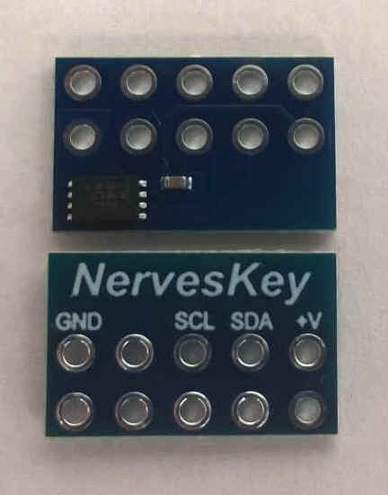

# Hardware

The NervesKey is a tiny circuit board with an ATECC608A cryptographic chip from Microchip Technology. The chip is a relatively inexpensive addition to embedded computing platforms that include an I2C bus. The NervesKey is primarily intended to offer a non-disruptive adaptation for the Raspberry Pi, but can also be used in other development applications.

**Figure 1**  Assembled NervesKey Boards

This directory contains hardware documentation for the production NervesKey board.  Historical versions from earlier development efforts are removed to avoid confusion, but in general those will operate the same way.  Some historical versions might contain the ATECC508A chip instead, but the NervesKey software is agnostic 
to this difference.  

The production NervesKey board contains a the tiny UDFN version of the part  [ATECC608A-MAHDA](https://www.digikey.com/product-detail/en/microchip-technology/ATECC608A-MAHDA-S/ATECC608A-MAHDA-STR-ND/7928113) and a 0.1uF 0402 size capacitor.  These boards are not easy assembled by a user, so they are professionally manufactured in quantity for the Nerves project and offered for sale in low quantity by Nerves contributor [Troodon Software, LLC](http://www.troodon-software.com/).  

## Primary Application - Bottom Side Solder Attach To Raspberry Pi

The easiest way to outfit a Raspberry Pi with a NervesKey is to solder it to the 'hat' expansion header on the bottom of the board as shown below.  This will connect the appropriate signals and keep the board out of the way of other uses of the hat header.  The NervesKey board is made relatively thin to support this application.

**Figure 2**  Typical NervesKey Application

See the [schematic](TSW19001_NERVESKEY_X1_SCH.PDF) for additional hardware details, notes, and examples.
